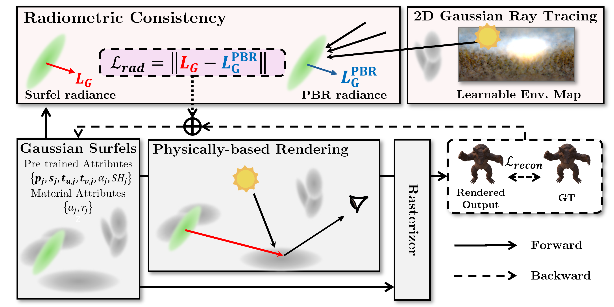
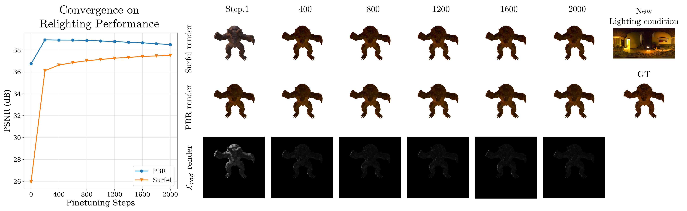

# Radiometrically Consistent Gaussian Surfels for Inverse Rendering (ICLR 2026 Oral)

<p align="center">
  
</p>

### [[Project]](https://qbhan.github.io/radiogs-page/) [[Paper]](https://arxiv.org/abs/2603.01491) 
          
> [Kyu Beom Han](https://qbhan.oopy.io/), Jaeyoon Kim, [Woo Jae Kim](https://wkim97.github.io/), [Jinhwan Seo](https://jinhseo.github.io/), [Sung-Eui Yoon](https://sgvr.kaist.ac.kr/~sungeui/) 

## Framework
<p align="center">
  
</p>

## Requirements and Installation
All experiments are tested on Ubuntu (20.04 or 22.04) with a the following GPUs.
- TITAN RTX, RTX 2080Ti, 3090, 3090Ti, 4080, 4090
- CUDA 11.8

```bash
conda create -n radiogs python=3.8

pip install torch==2.0.0 torchvision==0.15.1 torchaudio==2.0.1 --index-url https://download.pytorch.org/whl/cu118

pip install ffmpeg pillow open3d mediapy lpips scikit-image tqdm trimesh plyfile opencv-python pyexr kornia

# Install diff-surfel-rasterization and simple-knn
pip install submodules/diff-surfel-rasterization submodules/simple-knn

# Install raytracing (for compatibility with Ref-Gaussian during intial stage)
pip install submodules/raytracing

git clone https://github.com/NVlabs/nvdiffrast
pip install nvdiffrast/.

# Install 2D Gaussian Ray Tracer
cd submodules/surfel_tracer && rm -rf ./build && mkdir build && cd build && cmake .. && make && cd ../ && cd ../../
pip install submodules/surfel_tracer
```

## Dataset
Download the following datasets:
- TensoIR: [LINK](https://zenodo.org/record/7880113#.ZE68FHZBz18)
- Environment_Maps: [LINK](https://drive.google.com/file/d/10WLc4zk2idf4xGb6nPL43OXTTHvAXSR3/view?usp=share_link)
- Synthetic4Relight: [LINK](https://drive.google.com/file/d/1wWWu7EaOxtVq8QNalgs6kDqsiAm7xsRh/view?usp=sharing)
- TensoIR_Ind: [LINK](http://sgvr.kaist.ac.kr/~kbhan/TensoIR_Ind.zip)

Put the datasets under the `data` folder as below:
```
data/
    TensoIR/
    Environment_Maps/
    Synthetic4Relight/
    TensoIR_Ind/
```

## Training and Evaluation
See `ours_tir.sh` for training and evaluation scripts on TensoIR datasets.

You may modify the number of ray samples (e.g., `--diffuse_sample_num`) to control the GPU memory usage.
### Stage 1: Initialization
Initialize the geometry using simplified radiometric consistency loss
```bash
CUDA_VISIBLE_DEVICES=0 python train_init.py -s data/TensoIR/armadillo \
    -m outputs/TensoIR/armadillo/init --eval -w \
    --lambda_mask_entropy 0.02 \
    --volume_render_until_iter 40000 \
    --iterations 40000 \
    --lambda_dist 1000 \
    --lambda_light 0.01 \
    --train_sh_vol \
    --radiosity_from_iter 2000 \
    --lambda_radiosity 0.1 \
    --lambda_normal_smooth 0.02 \
    --lambda_radiosity 0.1 
```
### Stage 2: Inverse Rendering
```bash
CUDA_VISIBLE_DEVICES=0 python train.py -s data/TensoIR/armadillo --eval \
    -m outputs/TensoIR/armadillo/radiogs --iterations 20000 \
    --start_checkpoint_refgs outputs/TensoIR/armadillo/init/chkpnt40000.pth \
    --envmap_resolution 128 --diffuse_sample_num 64 --envmap_cubemap_lr 0.005 --init_roughness_value 0.6 \
    --lambda_base_color_smooth 0.2 --lambda_roughness_smooth 0.1 --lambda_light_smooth 0.02 --lambda_light 0.01 \
    --lr_scale 0.01 --lambda_nvs 1.0 --back_culling --lambda_mask_entropy 0.02 \
    --use_radiosity --lambda_radiosity 0.2 --radiosity_gaussian_num 2048 --radiosity_sample_num 64 \
    --use_rad_rndview --detach_rad_global
```
## Stage 3: Evaluation
```bash
# NVS evaluation
CUDA_VISIBLE_DEVICES=0 python render.py -m outputs/TensoIR/armadillo/radiogs --eval --diffuse_sample_num 64 --back_culling

# Compute albedo scale for alignment
CUDA_VISIBLE_DEVICES=0 python compute_albedo_scale_tensoir.py -m outputs/TensoIR/armadillo/radiogs

# Evaluate the decomposed material (albedo, normal)
CUDA_VISIBLE_DEVICES=0 python eval_material_tensoir.py -m outputs/TensoIR/armadillo/radiogs --albedo_rescale 2

# Evaluate the relighting performance
CUDA_VISIBLE_DEVICES=0 python eval_relighting_tensoir.py -m outputs/TensoIR/armadillo/radiogs --diffuse_sample_num 256 --light_sample_num 128 --albedo_rescale 2 -e light --back_culling
```

## Stage 4: Finetuning-based Relighting
<p align="center">
  
</p>

```bash
# finetune with radiometric consistency loss
CUDA_VISIBLE_DEVICES=0 python finetune.py -s data/TensoIR/armadillo --eval \
    -m outputs/TensoIR/armadillo/finetune --iterations 22000 \
    --start_checkpoint outputs/TensoIR/armadillo/radiogs/chkpnt20000.pth --envmap_resolution 128 --diffuse_sample_num 192 --lr_scale 0.0 \
    --use_radiosity --lambda_radiosity 1.0 --radiosity_gaussian_num 8192 --radiosity_sample_num 128 --light_sample_num 64 --use_rad_imp \
    --use_rad_rndview --detach_rad_mat --detach_rad_normal --detach_rad_global \
    --envmap_path data/Environment_Maps/high_res_envmaps_2k/city.hdr \
    --back_culling --features_lr 1e-4 --lambda_nvs 0.0

# evaluate relighting performance with finetune surfel radiance
CUDA_VISIBLE_DEVICES=0 python finetune_relighting_tensoir.py -m outputs/TensoIR/armadillo/finetune/radiogs \
        --diffuse_sample_num 256 --light_sample_num 128 --albedo_rescale 2 --back_culling \
        --finetune --iteration 22000
```
Please refer to other scripts in `scripts` for more details regarding other datasets.

## Acknowledge
Our work is built upon the following works:
- [IRGS](https://github.com/fudan-zvg/IRGS) (baseline of the framework)
- [Relightable 3DGS](https://github.com/NJU-3DV/Relightable3DGaussian)
- [nvdiffrast](https://github.com/NVlabs/nvdiffrast)
- [nvdiffrec](https://github.com/NVlabs/nvdiffrec)

Thanks for these great projects!

## BibTeX
If you find our code or paper helps, please consider citing:
```bibtex
@inproceedings{han2026radiogs,
  title={RadioGS: Radiometrically Consistent Gaussian Surfels for Inverse Rendering},
  author={Han, Kyu Beom and Kim, Jaeyoon and Kim, Woo Jae and Seo, Jinhwan and Yoon, Sung-Eui},
  booktitle={International Conference on Learning Representations (ICLR)},
  year={2026}
}
```
